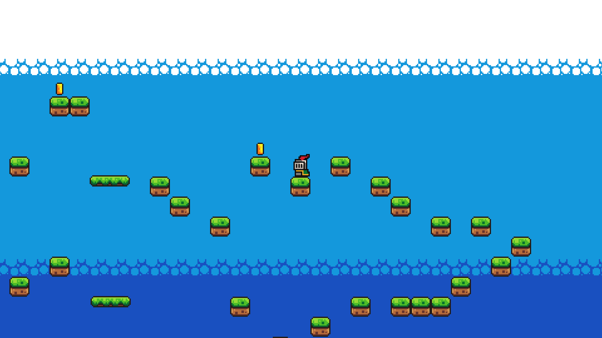

# About Game
You are a knight that likes to do frontflip and you are supposed to go right and collect coins to reach END.

**This is my first video game ever so it is very basic and somewhat trash but it is my trash!**

# Pictures

## Gameplay
**This game requires keyboard or gamepad!**

You can use arrow keys (left stick) or WASD for movement.

Space (A button in XBOX or equivalent) or W or Up Arrow for jump.

R (B button for XBOX or equivalent) for menu.

Backspace (Menu button for XBOX or equivalent) for restarting game.

M (X button for XBOX or equivalent) for muting game.

# Source
Made the ground by using this tutorial: https://youtu.be/LOhfqjmasi0?si=h_3O9HaNeL6ebevx    
You can find same sprites and sound in the description.
